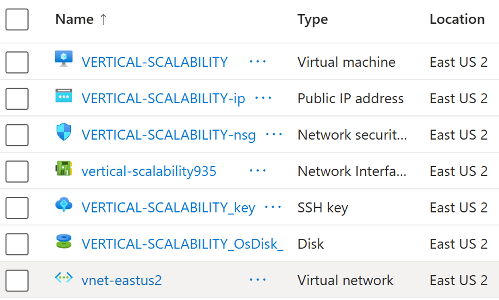
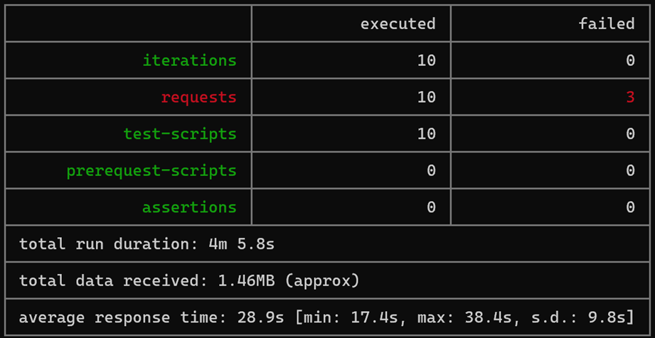
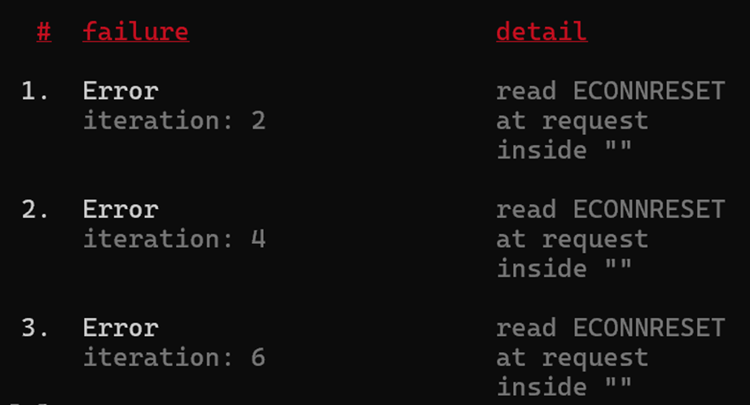
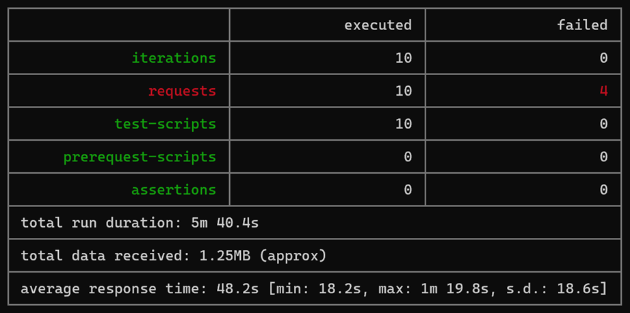
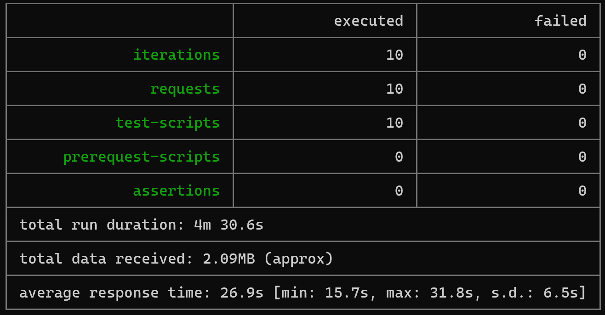

### Escuela Colombiana de Ingeniería

### Arquitecturas de Software - ARSW

## Escalamiento en Azure con Maquinas Virtuales, Sacale Sets y Service Plans

**Estudiantes:**

- Daniel Diaz.
- Vicente Garzon.

---

### Dependencias

- Cree una cuenta gratuita dentro de Azure. Para hacerlo puede guiarse de esta [documentación](https://azure.microsoft.com/es-es/free/students/). Al hacerlo usted contará con $100 USD para gastar durante 12 meses.

### Parte 0 - Entendiendo el escenario de calidad

Adjunto a este laboratorio usted podrá encontrar una aplicación totalmente desarrollada que tiene como objetivo calcular el enésimo valor de la secuencia de Fibonnaci.

**Escalabilidad**
Cuando un conjunto de usuarios consulta un enésimo número (superior a 1000000) de la secuencia de Fibonacci de forma concurrente y el sistema se encuentra bajo condiciones normales de operación, todas las peticiones deben ser respondidas y el consumo de CPU del sistema no puede superar el 70%.

### Parte 1 - Escalabilidad vertical

1. Diríjase a el [Portal de Azure](https://portal.azure.com/) y a continuación cree una maquina virtual con las características básicas descritas en la imágen 1 y que corresponden a las siguientes:
   - Resource Group = SCALABILITY_LAB
   - Virtual machine name = VERTICAL-SCALABILITY
   - Image = Ubuntu Server
   - Size = Standard B1ls
   - Username = scalability_lab
   - SSH publi key = Su llave ssh publica


2. Para conectarse a la VM use el siguiente comando, donde las `x` las debe remplazar por la IP de su propia VM (Revise la sección "Connect" de la virtual machine creada para tener una guía más detallada).

   `ssh scalability_lab@xxx.xxx.xxx.xxx`

3. Instale node, para ello siga la sección _Installing Node.js and npm using NVM_ que encontrará en este [enlace](https://linuxize.com/post/how-to-install-node-js-on-ubuntu-18.04/).
4. Para instalar la aplicación adjunta al Laboratorio, suba la carpeta `FibonacciApp` a un repositorio al cual tenga acceso y ejecute estos comandos dentro de la VM:

   `git clone <your_repo>`

   `cd <your_repo>/FibonacciApp`

   `npm install`

5. Para ejecutar la aplicación puede usar el comando `npm FibinacciApp.js`, sin embargo una vez pierda la conexión ssh la aplicación dejará de funcionar. Para evitar ese compartamiento usaremos _forever_. Ejecute los siguientes comando dentro de la VM.

   ` node FibonacciApp.js`

6. Antes de verificar si el endpoint funciona, en Azure vaya a la sección de _Networking_ y cree una _Inbound port rule_ tal como se muestra en la imágen. Para verificar que la aplicación funciona, use un browser y user el endpoint `http://xxx.xxx.xxx.xxx:3000/fibonacci/6`. La respuesta debe ser `The answer is 8`.


7. La función que calcula en enésimo número de la secuencia de Fibonacci está muy mal construido y consume bastante CPU para obtener la respuesta. Usando la consola del Browser documente los tiempos de respuesta para dicho endpoint usando los siguintes valores:

   - 1000000
   - 1010000
   - 1020000
   - 1030000
   - 1040000
   - 1050000
   - 1060000
   - 1070000
   - 1080000
   - 1090000

8. Dírijase ahora a Azure y verifique el consumo de CPU para la VM. (Los resultados pueden tardar 5 minutos en aparecer).


9. Ahora usaremos Postman para simular una carga concurrente a nuestro sistema. Siga estos pasos.

   - Instale newman con el comando `npm install newman -g`. Para conocer más de Newman consulte el siguiente [enlace](https://learning.getpostman.com/docs/postman/collection-runs/command-line-integration-with-newman/).
   - Diríjase hasta la ruta `FibonacciApp/postman` en una maquina diferente a la VM.
   - Para el archivo `[ARSW_LOAD-BALANCING_AZURE].postman_environment.json` cambie el valor del parámetro `VM1` para que coincida con la IP de su VM.
   - Ejecute el siguiente comando.

   ```
   newman run ARSW_LOAD-BALANCING_AZURE.postman_collection.json -e [ARSW_LOAD-BALANCING_AZURE].postman_environment.json -n 10 &
   newman run ARSW_LOAD-BALANCING_AZURE.postman_collection.json -e [ARSW_LOAD-BALANCING_AZURE].postman_environment.json -n 10
   ```

10. La cantidad de CPU consumida es bastante grande y un conjunto considerable de peticiones concurrentes pueden hacer fallar nuestro servicio. Para solucionarlo usaremos una estrategia de Escalamiento Vertical. En Azure diríjase a la sección _size_ y a continuación seleccione el tamaño `B2ms`.


11. Una vez el cambio se vea reflejado, repita el paso 7, 8 y 9.
12. Evalue el escenario de calidad asociado al requerimiento no funcional de escalabilidad y concluya si usando este modelo de escalabilidad logramos cumplirlo.
13. Vuelva a dejar la VM en el tamaño inicial para evitar cobros adicionales.

**Preguntas**

1. ¿Cuántos y cuáles recursos crea Azure junto con la VM?



Azure creó **7 recursos** automáticamente cuando se desplego la máquina virtual:

1. **Virtual machine** – `VERTICAL-SCALABILITY`
2. **Public IP address** – `VERTICAL-SCALABILITY-ip`
3. **Network security group (NSG)** – `VERTICAL-SCALABILITY-nsg`
4. **Network Interface (NIC)** – `vertical-scalability935`
5. **SSH Key** – `VERTICAL-SCALABILITY_key`
6. **Disk (OS Disk)** – `VERTICAL-SCALABILITY_OsDisk_`
7. **Virtual Network (VNet)** – `vnet-eastus2`

---

2. ¿Brevemente describa para qué sirve cada recurso?

- **Virtual machine (VM):** es el servidor donde se ejecuta tu aplicación o lo que instales. Es básicamente un computador en la nube.

- **Public IP address:** es la dirección que permite que la VM pueda ser accedida desde Internet (por ejemplo, con SSH o desde el navegador).

- **Network Security Group (NSG):** funciona como un firewall. Define qué puertos y protocolos se permiten o se bloquean para proteger la VM.

- **Network Interface (NIC):** es la tarjeta de red de la máquina virtual. Conecta la VM a la red virtual y le asigna su dirección IP privada.

- **SSH Key:** es la llave usada para autenticarse en la VM sin usar contraseña. Permite entrar por SSH de forma segura.

- **Disk (OS Disk):** es el disco donde está instalado el sistema operativo de la VM (Ubuntu, Windows, etc.).

- **Virtual Network (VNet):** es la red privada donde está conectada la VM. Ahí se manejan las direcciones privadas y la comunicación interna entre recursos de Azure.

---

3. ¿Al cerrar la conexión ssh con la VM, por qué se cae la aplicación que ejecutamos con el comando `npm FibonacciApp.js`? ¿Por qué debemos crear un _Inbound port rule_ antes de acceder al servicio?

Cuando ejecutamos `npm FibonacciApp.js` directamente en la sesión SSH, el proceso queda ligado a esa sesión. Al cerrar la conexión SSH la sesión termina, y con ella todos los procesos asociados. Por eso la aplicación se cae. Para evitarlo usamos una herramienta como **forever**, que ejecuta el proceso en segundo plano y lo mantiene activo aunque cerremos la sesión.

Por otro lado, por defecto solo está abierto el puerto SSH (22). Para que otros puedan acceder al servicio por el puerto 3000, es necesario crear una **Inbound port rule** en Azure que permita ese tráfico.

---

4. Adjunte tabla de tiempos e interprete por qué la función tarda tando tiempo.


La función tarda tanto porque la implementación no está optimizada. Para números tan grandes, el programa realiza demasiadas operaciones y usa mucha CPU, lo que hace que el tiempo de respuesta aumente bastante.

---

5. Adjunte imágen del consumo de CPU de la VM e interprete por qué la función consume esa cantidad de CPU.


El consumo de CPU es alto porque la función de Fibonacci requiere una gran cantidad de cálculos. Como no usa optimizaciones como memoización, la CPU trabaja constantemente durante toda la ejecución.

---

6. Adjunte la imagen del resumen de la ejecución de Postman. Interprete:
   - Tiempos de ejecución de cada petición.
   - Si hubo fallos documentelos y explique.





Los tiempos de las peticiones variaron entre ~17.4 s y 38.4 s en la VM pequeña. Se presentaron fallos por _timeout_, lo que muestra que la máquina se estaba saturando.

---

7. ¿Cuál es la diferencia entre los tamaños `B2ms` y `B1ls` (no solo busque especificaciones de infraestructura)?

El tamaño **B1ls** es muy básico, con poca memoria y un rendimiento limitado.  
El **B2ms** tiene más memoria, más CPU y mejor rendimiento.

En este laboratorio, el B2ms soportó más carga y respondió más rápido. La diferencia no es solo técnica: también cambia el costo, y el B2ms es más caro.

---

8. ¿Aumentar el tamaño de la VM es una buena solución en este escenario?, ¿Qué pasa con la FibonacciApp cuando cambiamos el tamaño de la VM?

Sí, aumentar el tamaño mejora el rendimiento, pero no soluciona el problema completamente. La función de Fibonacci sigue siendo muy pesada y genera lentitud incluso con más recursos. Al hacer el cambio de tamaño, la aplicación siguió funcionando y respondió más rápido, pero aparecieron fallos igualmente.

---

9. ¿Qué pasa con la infraestructura cuando cambia el tamaño de la VM? ¿Qué efectos negativos implica?


El costo mensual aumenta y el sistema consume más recursos. Aunque mejora el rendimiento, la escalabilidad sigue siendo limitada si la aplicación está mal optimizada. Confiar solo en máquinas más grandes no es sostenible, es mejor optimizar el código o escalar horizontalmente.

---

10. ¿Hubo mejora en el consumo de CPU o en los tiempos de respuesta? Si/No ¿Por qué?


Sí, hubo mejora, la CPU respondió mejor y los tiempos bajaron, pero la función sigue siendo tan pesada que la mejora no compensa totalmente.

---

11. Aumente la cantidad de ejecuciones paralelas del comando de postman a `4`. ¿El comportamiento del sistema es porcentualmente mejor?



Al subir a 4 ejecuciones paralelas, el comportamiento **no** mejoró proporcionalmente, los errores continuaron y los tiempos siguieron altos. Esto muestra que la aplicación y/o la infraestructura tienen un límite claro al manejar mucha concurrencia.

### Parte 2 - Escalabilidad horizontal

#### Crear el Balanceador de Carga

Antes de continuar puede eliminar el grupo de recursos anterior para evitar gastos adicionales y realizar la actividad en un grupo de recursos totalmente limpio.

1. El Balanceador de Carga es un recurso fundamental para habilitar la escalabilidad horizontal de nuestro sistema, por eso en este paso cree un balanceador de carga dentro de Azure tal cual como se muestra en la imágen adjunta.


2. A continuación cree un _Backend Pool_, guiese con la siguiente imágen.


3. A continuación cree un _Health Probe_, guiese con la siguiente imágen.


4. A continuación cree un _Load Balancing Rule_, guiese con la siguiente imágen.


5. Cree una _Virtual Network_ dentro del grupo de recursos, guiese con la siguiente imágen.


#### Crear las maquinas virtuales (Nodos)

Ahora vamos a crear 3 VMs (VM1, VM2 y VM3) con direcciones IP públicas standar en 3 diferentes zonas de disponibilidad. Después las agregaremos al balanceador de carga.

1. En la configuración básica de la VM guíese por la siguiente imágen. Es importante que se fije en la "Avaiability Zone", donde la VM1 será 1, la VM2 será 2 y la VM3 será 3.


2. En la configuración de networking, verifique que se ha seleccionado la _Virtual Network_ y la _Subnet_ creadas anteriormente. Adicionalmente asigne una IP pública y no olvide habilitar la redundancia de zona.


3. Para el Network Security Group seleccione "avanzado" y realice la siguiente configuración. No olvide crear un _Inbound Rule_, en el cual habilite el tráfico por el puerto 3000. Cuando cree la VM2 y la VM3, no necesita volver a crear el _Network Security Group_, sino que puede seleccionar el anteriormente creado.


4. Ahora asignaremos esta VM a nuestro balanceador de carga, para ello siga la configuración de la siguiente imágen.


5. Finalmente debemos instalar la aplicación de Fibonacci en la VM. para ello puede ejecutar el conjunto de los siguientes comandos, cambiando el nombre de la VM por el correcto

```
git clone https://github.com/daprieto1/ARSW_LOAD-BALANCING_AZURE.git

curl -o- https://raw.githubusercontent.com/creationix/nvm/v0.34.0/install.sh | bash
source /home/vm1/.bashrc
nvm install node

cd ARSW_LOAD-BALANCING_AZURE/FibonacciApp
npm install

npm install forever -g
forever start FibonacciApp.js
```

Realice este proceso para las 3 VMs, por ahora lo haremos a mano una por una, sin embargo es importante que usted sepa que existen herramientas para aumatizar este proceso, entre ellas encontramos Azure Resource Manager, OsDisk Images, Terraform con Vagrant y Paker, Puppet, Ansible entre otras.

#### Probar el resultado final de nuestra infraestructura

1. Porsupuesto el endpoint de acceso a nuestro sistema será la IP pública del balanceador de carga, primero verifiquemos que los servicios básicos están funcionando, consuma los siguientes recursos:

```
http://52.155.223.248/
http://52.155.223.248/fibonacci/1
```

2. Realice las pruebas de carga con `newman` que se realizaron en la parte 1 y haga un informe comparativo donde contraste: tiempos de respuesta, cantidad de peticiones respondidas con éxito, costos de las 2 infraestrucruras, es decir, la que desarrollamos con balanceo de carga horizontal y la que se hizo con una maquina virtual escalada.

3. Agregue una 4 maquina virtual y realice las pruebas de newman, pero esta vez no lance 2 peticiones en paralelo, sino que incrementelo a 4. Haga un informe donde presente el comportamiento de la CPU de las 4 VM y explique porque la tasa de éxito de las peticiones aumento con este estilo de escalabilidad.

```
newman run ARSW_LOAD-BALANCING_AZURE.postman_collection.json -e [ARSW_LOAD-BALANCING_AZURE].postman_environment.json -n 10 &
newman run ARSW_LOAD-BALANCING_AZURE.postman_collection.json -e [ARSW_LOAD-BALANCING_AZURE].postman_environment.json -n 10 &
newman run ARSW_LOAD-BALANCING_AZURE.postman_collection.json -e [ARSW_LOAD-BALANCING_AZURE].postman_environment.json -n 10 &
newman run ARSW_LOAD-BALANCING_AZURE.postman_collection.json -e [ARSW_LOAD-BALANCING_AZURE].postman_environment.json -n 10
```

## Preguntas y Respuestas

### **¿Cuáles son los tipos de balanceadores de carga en Azure y en qué se diferencian?**

Azure tiene dos tipos principales:

- **Load Balancer Público:** se usa cuando el tráfico viene desde Internet. Expone una IP pública y redirige las peticiones a las máquinas del backend.

- **Load Balancer Interno (Privado):** solo funciona dentro de la red virtual. No expone una IP pública y sirve para dividir carga entre servicios internos.

La diferencia es básicamente de alcance: uno recibe tráfico externo y el otro solo tráfico interno dentro de Azure.

---

### **¿Qué es SKU, qué tipos hay y en qué se diferencian?**

SKU es la “versión” o “modelo” de un recurso en Azure. Define su capacidad, características y precio.

En Load Balancers existen dos tipos:

- **Basic:** más limitado, menos capacidad y menos características.
- **Standard:** soporta más tráfico, tiene más funcionalidades, mejor seguridad y mayor disponibilidad.

La diferencia está en rendimiento, confiabilidad y costo.

---

### **¿Por qué el balanceador de carga necesita una IP pública?**

Porque es el punto de entrada para todos los usuarios. Sin una IP pública, nadie desde Internet podría acceder al servicio, así que el balanceador la usa para recibir el tráfico y distribuirlo a las VMs.

---

### **¿Cuál es el propósito del Backend Pool?**

El Backend Pool define **qué máquinas virtuales** (o instancias) van a recibir el tráfico del balanceador. Es básicamente la lista de servidores que atienden las peticiones.

---

### **¿Cuál es el propósito del Health Probe?**

El Health Probe verifica constantemente si cada VM está funcionando. Si una VM deja de responder, el balanceador deja de enviarle tráfico. Esto evita que las peticiones caigan en una máquina que esté caída o saturada.

---

### **¿Cuál es el propósito de la Load Balancing Rule?**

La Load Balancing Rule define _cómo_ se distribuye el tráfico:

- qué puerto escucha el balanceador,
- a qué puerto interno lo envía,
- qué protocolo usa,
- y qué backend pool debe recibir las peticiones.

#### **Tipos de sesión persistente**

- **None:** las peticiones de un mismo cliente pueden ir a diferentes VMs.
- **Client IP:** el cliente siempre va a la misma VM.
- **Client IP + Protocol:** cliente y protocolo deben coincidir para enviarlo a la misma VM.

#### **¿Por qué esto afecta la escalabilidad?**

Si una VM recibe siempre al mismo cliente y ese cliente hace muchas solicitudes, esa instancia puede saturarse. Sin persistencia, el sistema distribuye mejor la carga.

---

### **¿Qué es una Virtual Network?**

Es una red privada creada en Azure donde los recursos pueden comunicarse de forma segura, como si estuvieran en la misma LAN.

---

### **¿Qué es una Subnet?**

Es una división interna dentro de una Virtual Network.  
Sirve para separar y organizar los recursos en segmentos más pequeños.

---

### **¿Para qué sirven los address space y address range?**

- **Address Space:** el conjunto completo de direcciones IP disponibles en la red virtual.

- **Address Range:** el rango específico que se asigna a una subnet dentro del address space.

Es igual que dividir una red grande en varias redes pequeñas.

---

### **¿Qué son las Availability Zones y por qué seleccionamos 3 zonas?**

Las Availability Zones son ubicaciones físicas separadas dentro de la misma región de Azure. Cada zona tiene su propia energía, red y refrigeración para evitar fallos en cadena.

Seleccionamos 3 zonas para que:

- si una zona falla,
- las otras dos sigan funcionando,
- y la aplicación permanezca disponible.

---

### **¿Qué significa que una IP sea zone-redundant?**

Significa que la IP sigue funcionando aunque alguna zona falle. No se “cae” si una zona de Azure deja de responder.

---

### **¿Cuál es el propósito del Network Security Group?**

Es un firewall que controla el tráfico de entrada y salida de las VMs o subnets. Permite definir puertos, protocolos, orígenes y destinos.

---

### **Informe de Newman 1 (Punto 2)**




- Los tiempos mejoraron al usar una VM más grande (~17.4 s - 38.4 s vs ~15.7 s - 31.8 s).
- No hubo fallos por timeout (3 vs 0).
- Esto muestra que la mejora por hardware tiene límites si el código sigue siendo pesado.
- La infraestructura horizontal distribuye la carga, pero la función Fibonacci sigue siendo el cuello de botella.

---

### **Diagrama de Despliegue**


---
